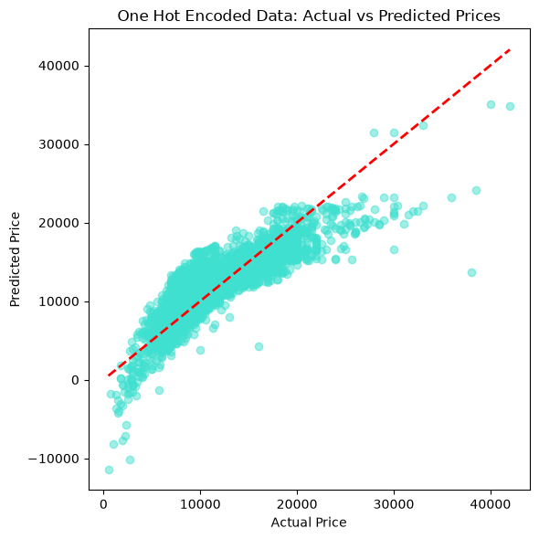
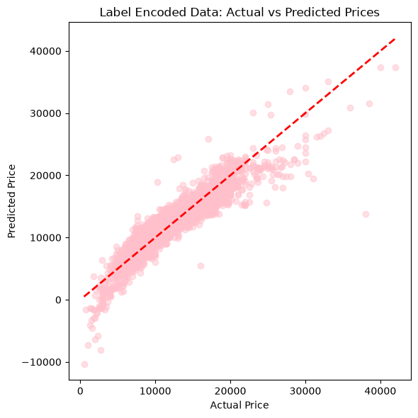

# Ford Car Price Prediction using Linear Regression

Predicting used Ford car prices from listing data using Linear Regression, with a comparison between **One-Hot Encoding** and **Label Encoding** for categorical features.

## Dataset

Source: [Ford Used Car Listing dataset, Kaggle](https://www.kaggle.com/)
File: `ford.csv` — 17,966 rows, 9 columns

| Column | Description |
|---|---|
| `model` | Car model (e.g. Fiesta, Focus, Ka, Puma) |
| `year` | Year of manufacture/registration |
| `price` | Sale price (target variable) |
| `transmission` | Transmission type (Manual, Automatic, Semi-Auto) |
| `mileage` | Total mileage driven |
| `fuelType` | Fuel type (Petrol, Diesel, Hybrid, Electric) |
| `tax` | Road tax amount |
| `mpg` | Miles per gallon (fuel efficiency) |
| `engineSize` | Engine size in litres |

## Project Workflow

### 1. Exploratory Data Analysis (EDA)
- Loaded the dataset with `pandas` and inspected structure using `.head()` and `.describe()`
- Checked summary statistics for numerical columns (`year`, `price`, `mileage`, `tax`, `mpg`, `engineSize`)
- Reviewed distribution and range of values, mean price ≈ £12,280, mean mileage ≈ 23,363

### 2. Preprocessing
- Encoded categorical columns (`model`, `transmission`, `fuelType`) two ways, to compare their effect on model performance:
  - **Label Encoding** — categories mapped to integers, resulting in 8 total columns
  - **One-Hot Encoding** — categories expanded into binary indicator columns, resulting in 34 total columns
- Scaled numerical features (`model`, `year`, `transmission`, `mileage`, `fuelType`, `tax`, `mpg`, `engineSize`) using `StandardScaler` for the label-encoded version
- Split data into train/test sets for model evaluation

### 3. Model
- Trained a **Linear Regression** model separately on the One-Hot Encoded dataset and the Label Encoded dataset
- Evaluated both using **R²** and **Adjusted R²** on the test set

### 4. Results

| Encoding | R² | Adjusted R² |
|---|---|---|
| One-Hot Encoding | 0.8464 | 0.8450 |
| Label Encoding | 0.7366 | 0.7360 |

**One-Hot Encoding outperformed Label Encoding** on this dataset. This makes sense since `model` is a nominal (unordered) categorical feature — Label Encoding imposes an artificial numeric ordering between car models that doesn't reflect any real relationship, while One-Hot Encoding avoids that by treating each category independently.

### 5. Actual vs Predicted Visualization

Scatter plots comparing actual vs predicted prices for both encoding strategies, with a red dashed line marking perfect prediction (y = x). Points closer to the line indicate more accurate predictions.

**One-Hot Encoding:**



**Label Encoding:**



## Files in this Repository

| File | Description |
|---|---|
| `ford.ipynb` | Jupyter notebook with full EDA, preprocessing, model training, and evaluation |
| `ford.csv` | Dataset used for training and testing |
| `1.png` | Actual vs Predicted plot (One-Hot Encoding) |
| `2.png` | Actual vs Predicted plot (Label Encoding) |

## Tech Stack

- Python
- pandas, NumPy
- scikit-learn (LinearRegression, StandardScaler, train_test_split)
- matplotlib

## How to Run

1. Clone the repository:
   ```bash
   git clone https://github.com/nithishayasam/Carprice_prediction_using_Linear_Regression.git
   ```
2. Install dependencies:
   ```bash
   pip install pandas numpy scikit-learn matplotlib
   ```
3. Open `ford.ipynb` in Jupyter Notebook / VS Code and run all cells.

## Key Takeaway

For this dataset, **One-Hot Encoding is the better preprocessing choice** for the `model` column, since it avoids introducing false ordinal relationships between car models that Label Encoding creates — leading to a meaningfully higher R² score.
